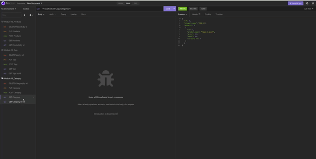

# Ethernet-Retail

    Server-side functionality for an e-commerce website

## Description

```
This is the back-end code for an e-commerce site to allow the user to modify the sites database.

```

## Meeting the Clients Needs

```
* I created a functional back-end that enables the user to modify the database thereby keeping their e-commerce site up to date.

* I learned that in order for everything to run well in the backend it is crucial to have the correct syntax.

```

## Video Walkthrough



You can find the video walkthrough here: [Ethernet-Retail](https://youtu.be/E_iMLgA_4qQ/)
